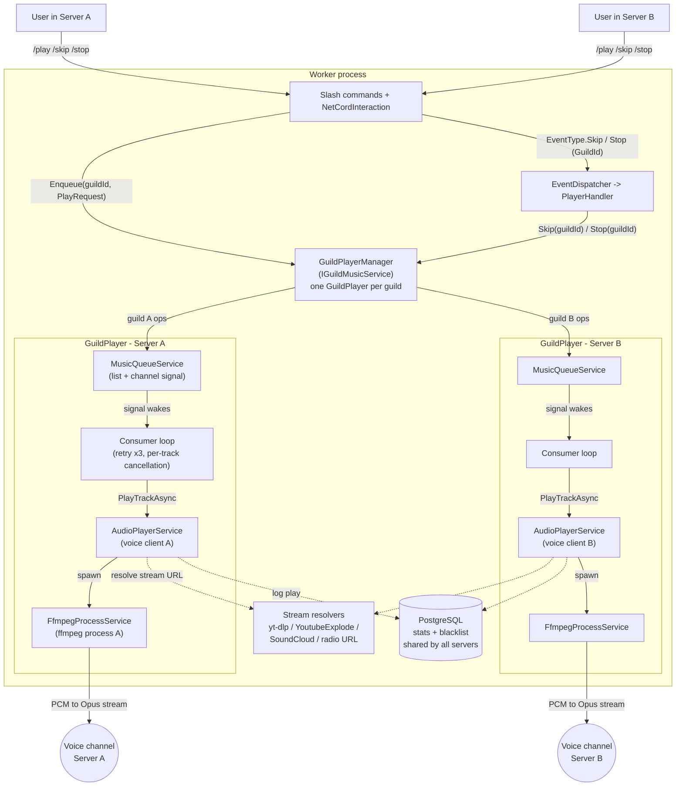

# Discord Music Bot

A .NET 10 Discord bot for music playback, supporting YouTube, SoundCloud, Spotify (playlist metadata), and radio streams. Supports multiple servers concurrently - each server gets its own queue, player, and voice connection. Includes a React-based web dashboard for statistics and radio-source management.

**Note:** This application is designed to run on Linux via Docker. A Dockerfile and docker-compose setup are provided.

## Installation

1. Create a Discord bot and add it to your server. Follow the [Discord Developer docs](https://discord.com/developers/docs/intro).
2. Set up the necessary bot permissions. See [Permissions](https://discord.com/developers/docs/topics/permissions).
3. Obtain a Discord bot token. See [OAuth2 Bots](https://discord.com/developers/docs/topics/oauth2#bots).
4. Clone this repository.
5. Configure `deployment/.env` with your values (Discord token, Spotify credentials, database, JWT, etc.).
6. Build and run with Docker:
   ```
   docker-compose -f deployment/docker-compose.yml up --build
   ```

## Development

```bash
# Build the whole solution (requires Bun for the frontend build)
dotnet build discord-project.slnx

# Run all tests (integration tests need a local Docker daemon for Testcontainers)
dotnet test src/Tests/Tests.csproj

# Unit tests only (no Docker required)
dotnet test src/Tests/Tests.csproj --filter "FullyQualifiedName~Tests.Unit"
```

Tests run automatically in CI (`.github/workflows/ci.yml`) on pushes and pull requests to `master`; pushes to `master` are deployed via `.github/workflows/release.yml`.

## Architecture

One bot process serves many servers. Commands address a guild through `IGuildMusicService`; `GuildPlayerManager` lazily creates one `GuildPlayer` per guild, each with its own queue, consumer loop, voice client, and FFmpeg process, so playback in one server never affects another. Statistics and the blacklist are shared across all servers.



## Technologies Used

### Backend
- [.NET 10](https://dotnet.microsoft.com) / ASP.NET Core
- [NetCord](https://github.com/NetCordDev/NetCord) - Discord bot framework
- [Entity Framework Core](https://learn.microsoft.com/en-us/ef/core/) + [PostgreSQL](https://www.postgresql.org)
- [YoutubeExplode](https://github.com/Tyrrrz/YoutubeExplode) / [YoutubeDLSharp](https://github.com/Bluegrams/YoutubeDLSharp) + [yt-dlp](https://github.com/yt-dlp/yt-dlp)
- [SoundCloudExplode](https://github.com/jerry08/SoundCloudExplode)
- [Spotify Web API](https://developer.spotify.com/documentation/web-api) - playlist metadata
- [FFmpeg](https://ffmpeg.org) - audio processing
- [libopus](https://opus-codec.org) / [libsodium](https://doc.libsodium.org) / [libdave](https://github.com/discord/libdave) - voice encoding and encryption
- [xUnit](https://xunit.net) + [NSubstitute](https://nsubstitute.github.io) + [Testcontainers](https://dotnet.testcontainers.org) - testing

### Frontend
- [React 19](https://react.dev) with TypeScript
- [TanStack Router](https://tanstack.com/router) / [TanStack Query](https://tanstack.com/query)
- [Recharts](https://recharts.org)
- [Vite](https://vite.dev) + [Bun](https://bun.sh)
